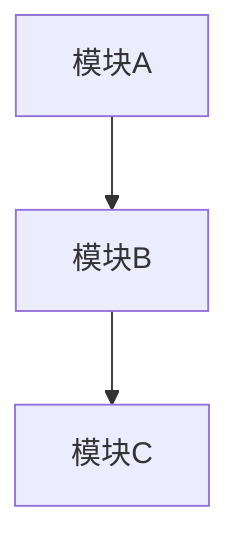

# 架构设计模板

## 文档信息
- 标题：《系统名称》架构设计方案
- 版本：v1.0.0
- 作者：作者名
- 更新日期：YYYY-MM-DD
- 状态：[✅|🏗️|⏳] 已完成|进行中|待开始

## 修订历史
| 版本 | 修订日期 | 修订人 | 修订说明 |
|------|----------|--------|----------|
| v1.0.0 | YYYY-MM-DD | 作者名 | 初始版本 |

## 1. 设计目标
### 1.1 业务目标
- 目标一
- 目标二
- 目标三

### 1.2 技术目标
- 性能指标
- 可用性要求
- 扩展性要求
- 安全性要求

## 2. 系统架构
### 2.1 整体架构

### 2.2 逻辑架构
- 业务层
- 应用层
- 数据层
- 基础设施层

### 2.3 技术架构
- 开发框架
- 中间件选型
- 数据库方案
- 部署方案

## 3. 核心模块设计
### 3.1 模块一
- 功能描述
- 设计要点
- 接口定义
- 数据流转

### 3.2 模块二
- 功能描述
- 设计要点
- 接口定义
- 数据流转

## 4. 关键技术方案
### 4.1 高可用方案
- 集群设计
- 容灾方案
- 监控告警

### 4.2 安全方案
- 认证授权
- 数据安全
- 网络安全

### 4.3 性能方案
- 性能优化
- 缓存策略
- 限流方案

## 5. 数据库设计
### 5.1 数据模型
- ER图
- 表结构
- 索引设计

### 5.2 数据流转
- 数据流图
- 读写分离
- 分库分表

## 6. 部署架构
### 6.1 部署方案
- 部署架构图
- 网络规划
- 资源需求

### 6.2 运维方案
- 监控方案
- 备份方案
- 应急预案

## 7. 扩展性设计
### 7.1 水平扩展
- 集群扩展
- 数据扩展
- 功能扩展

### 7.2 垂直扩展
- 性能提升
- 容量提升
- 功能增强

## 8. 风险评估
### 8.1 技术风险
- 风险点
- 应对措施
- 预案准备

### 8.2 成本评估
- 硬件成本
- 软件成本
- 人力成本
- 维护成本

## 附录
### 附录1：术语表
| 术语 | 解释 |
|------|------|
| 术语1 | 解释1 |
| 术语2 | 解释2 |

### 附录2：参考文档
1. 参考文档一
2. 参考文档二 