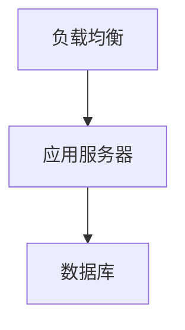

# 部署文档模板

## 文档信息
- 标题：《系统名称》部署手册
- 版本：v1.0.0
- 作者：作者名
- 更新日期：YYYY-MM-DD
- 状态：[✅|🏗️|⏳] 已完成|进行中|待开始

## 修订历史
| 版本 | 修订日期 | 修订人 | 修订说明 |
|------|----------|--------|----------|
| v1.0.0 | YYYY-MM-DD | 作者名 | 初始版本 |

## 1. 部署说明
### 1.1 部署架构


### 1.2 环境要求
#### 硬件要求
| 资源项 | 最低配置 | 推荐配置 |
|--------|----------|----------|
| CPU | 4核 | 8核 |
| 内存 | 8G | 16G |
| 磁盘 | 100G | 200G |

#### 软件要求
| 软件名称 | 版本要求 | 说明 |
|----------|----------|------|
| 操作系统 | CentOS 7+ | 推荐7.9 |
| Docker | 20.10+ | 容器运行环境 |
| MySQL | 8.0+ | 数据库 |

#### 网络要求
- 防火墙配置
- 端口开放
- 网络带宽

## 2. 前置准备
### 2.1 基础环境
```bash
# 系统配置
sysctl -w vm.max_map_count=262144
sysctl -w net.ipv4.ip_forward=1

# 安装基础工具
yum install -y wget curl net-tools
```

### 2.2 依赖安装
- Docker安装
- Docker Compose安装
- 其他依赖组件

## 3. 部署步骤
### 3.1 配置文件准备
```yaml
# 配置文件示例
version: '3'
services:
  app:
    image: app:latest
```

### 3.2 部署命令
```bash
# 部署命令示例
docker-compose up -d
```

### 3.3 验证检查
- 服务状态检查
- 日志检查
- 功能验证

## 4. 配置说明
### 4.1 系统配置
| 配置项 | 说明 | 默认值 | 建议值 |
|--------|------|--------|--------|
| 配置1 | 说明1 | 默认值1 | 建议值1 |
| 配置2 | 说明2 | 默认值2 | 建议值2 |

### 4.2 优化建议
- 系统优化
- JVM优化
- 数据库优化

## 5. 运维管理
### 5.1 启停命令
```bash
# 启动服务
systemctl start service

# 停止服务
systemctl stop service

# 重启服务
systemctl restart service
```

### 5.2 日志查看
```bash
# 查看应用日志
tail -f /var/log/app.log

# 查看系统日志
journalctl -u service
```

### 5.3 监控检查
- 健康检查接口
- 监控指标
- 告警配置

## 6. 常见问题
### 问题1：启动失败
**现象**：服务无法启动
**原因**：可能的原因分析
**解决方案**：详细的解决步骤

### 问题2：性能问题
**现象**：服务响应慢
**原因**：可能的原因分析
**解决方案**：详细的解决步骤

## 7. 备份恢复
### 7.1 备份方案
- 数据备份
- 配置备份
- 备份策略

### 7.2 恢复流程
1. 停止服务
2. 恢复数据
3. 启动服务
4. 验证检查

## 附录
### 附录1：部署清单
- 部署包列表
- 配置文件列表
- 脚本文件列表

### 附录2：参考文档
1. 官方部署文档
2. 最佳实践指南 