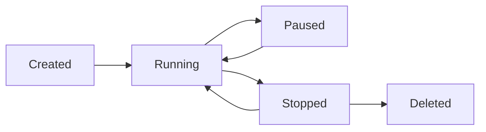

# 容器基础概念

## 版本信息
- 版本号: v1.0.0
- 更新日期: 2024-03-21
- 状态: [✅]已完成

## 概述

容器是一种轻量级、可移植的计算环境，它包含运行应用程序所需的所有依赖。本文档详细介绍容器的基本概念、特点和优势。

### 核心特性
- 轻量级虚拟化
- 快速部署
- 环境一致性
- 资源隔离

## 基础概念

### 1. 容器定义
```
┌─────────────────────────────────────────┐
│              Container                  │
│                                        │
│  ┌────────────────────────────────┐    │
│  │     Application & Libraries    │    │
│  └────────────────────────────────┘    │
│                                        │
│  ┌────────────────────────────────┐    │
│  │     Container Runtime          │    │
│  └────────────────────────────────┘    │
│                                        │
│  ┌────────────────────────────────┐    │
│  │     Host Operating System      │    │
│  └────────────────────────────────┘    │
└─────────────────────────────────────────┘
```

### 2. 容器组件
1. 命名空间（Namespace）
   - PID命名空间
   - 网络命名空间
   - 挂载命名空间
   - 用户命名空间
   - UTS命名空间
   - IPC命名空间

2. 控制组（cgroups）
   - CPU限制
   - 内存限制
   - 磁盘I/O限制
   - 网络带宽限制

## 容器特点

### 1. 轻量级
```yaml
# 容器与虚拟机对比
container:
  - 共享主机内核
  - 秒级启动
  - MB级大小
  - 低资源开销

virtual_machine:
  - 独立内核
  - 分钟级启动
  - GB级大小
  - 高资源开销
```

### 2. 可移植性
```bash
# 容器标准化
docker build -t myapp:1.0 .
docker save myapp:1.0 > myapp.tar
docker load < myapp.tar

# 跨平台运行
docker run -d myapp:1.0
```

## 容器优势

### 1. 开发优势
- 环境一致性
- 快速迭代
- 版本控制
- 组件复用

### 2. 运维优势
```yaml
# 运维效益
advantages:
  deployment:
    - 快速部署
    - 自动化管理
    - 弹性扩缩容
  maintenance:
    - 故障隔离
    - 易于更新
    - 资源优化
  monitoring:
    - 统一监控
    - 日志集中化
    - 性能分析
```

## 容器生命周期

### 1. 基本状态


### 2. 状态管理
```bash
# 容器状态管理命令
docker create myapp:1.0    # 创建容器
docker start container_id  # 启动容器
docker pause container_id  # 暂停容器
docker stop container_id   # 停止容器
docker rm container_id     # 删除容器
```

## 容器标准

### 1. OCI标准
- runtime-spec：容器运行时规范
- image-spec：容器镜像规范
- distribution-spec：镜像分发规范

### 2. 标准实现
```yaml
# 常见实现
runtimes:
  - runc
  - crun
  - kata-runtime
  - gvisor

engines:
  - docker
  - containerd
  - cri-o
  - podman
```

## 最佳实践

### 1. 容器设计原则
- 单一职责
- 无状态设计
- 最小化依赖
- 资源限制

### 2. 安全建议
```yaml
# 安全配置
security:
  - 最小权限原则
  - 镜像安全扫描
  - 资源隔离
  - 网络安全策略
```

## 常见问题

### Q1: 容器与虚拟机的区别是什么？
A1:
1. 架构差异
   - 容器共享主机内核
   - 虚拟机使用独立内核
2. 资源开销
   - 容器轻量级
   - 虚拟机重量级

### Q2: 容器的主要使用场景有哪些？
A2:
1. 应用场景
   - 微服务架构
   - 持续集成/部署
   - 开发测试环境
   - 云原生应用

## 参考资料
- [Docker官方文档](https://docs.docker.com/)
- [OCI规范](https://opencontainers.org/)
- [Kubernetes文档](https://kubernetes.io/docs/concepts/containers/)
