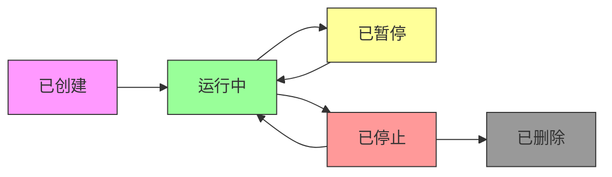
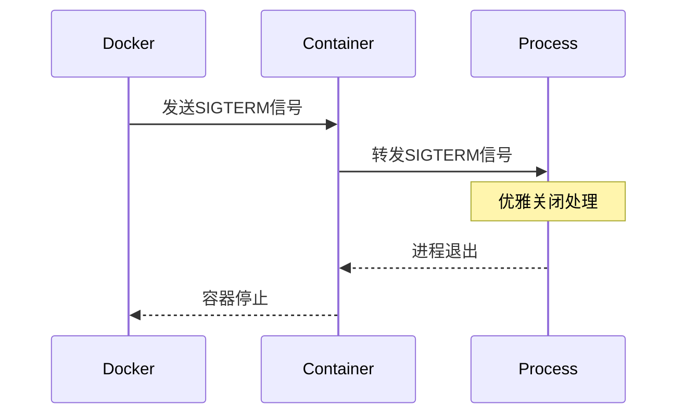

# 容器生命周期管理

## 版本信息
- 版本号: v1.0.0
- 更新日期: 2024-03-21
- 状态: [✅]已完成

## 概述

容器生命周期管理是容器运行时的核心功能之一，包括容器的创建、启动、暂停、恢复、停止和删除等操作。本文档详细介绍容器生命周期的管理方法和最佳实践。

### 核心特性
- 状态管理
- 资源回收
- 优雅终止
- 自动重启

## 生命周期状态

### 1. 状态流转图


### 2. 状态说明
```yaml
# 容器状态定义
container_states:
  created:
    description: "容器已创建但未启动"
    next_states: ["running"]
  
  running:
    description: "容器正在运行中"
    next_states: ["paused", "stopped"]
  
  paused:
    description: "容器已暂停运行"
    next_states: ["running"]
  
  stopped:
    description: "容器已停止运行"
    next_states: ["running", "deleted"]
  
  deleted:
    description: "容器已被删除"
    next_states: []
```

## 生命周期管理

### 1. 基本操作
```bash
# 创建容器
docker create --name myapp nginx:latest

# 启动容器
docker start myapp

# 暂停容器
docker pause myapp

# 恢复容器
docker unpause myapp

# 停止容器
docker stop myapp

# 删除容器
docker rm myapp
```

### 2. 高级操作
```yaml
# 高级管理命令
advanced_operations:
  restart_policy:
    - always
    - unless-stopped
    - on-failure
    - no
  
  health_check:
    - http_get
    - exec
    - tcp_socket
  
  update_config:
    - rolling_update
    - stop_grace_period
    - update_delay
```

## 容器配置

### 1. 运行配置
```yaml
# 容器运行配置
container_config:
  basic:
    - name: "myapp"
    - image: "nginx:latest"
    - command: ["/bin/sh", "-c", "nginx"]
  
  restart:
    - policy: "always"
    - max_retries: 3
  
  resources:
    - memory: "512m"
    - cpu: "1.0"
```

### 2. 健康检查
```yaml
# 健康检查配置
healthcheck:
  test: ["CMD", "curl", "-f", "http://localhost"]
  interval: 30s
  timeout: 10s
  retries: 3
  start_period: 40s
```

## 状态监控

### 1. 容器状态
```bash
# 查看容器状态
docker ps -a

# 查看容器详情
docker inspect myapp

# 查看容器统计信息
docker stats myapp
```

### 2. 日志管理
```yaml
# 日志配置
logging:
  driver: "json-file"
  options:
    max-size: "10m"
    max-file: "3"
    compress: "true"
```

## 资源清理

### 1. 自动清理
```bash
# 清理停止的容器
docker container prune

# 清理所有未使用资源
docker system prune -a

# 设置自动清理策略
docker run --rm nginx
```

### 2. 手动清理
```yaml
# 清理策略
cleanup_strategy:
  containers:
    - 删除停止的容器
    - 清理退出的容器
  
  resources:
    - 清理未使用镜像
    - 清理未使用数据卷
    - 清理构建缓存
```

## 优雅终止

### 1. 终止流程


### 2. 终止配置
```yaml
# 终止配置
termination:
  grace_period: 30s
  signals:
    - SIGTERM
    - SIGKILL
  hooks:
    - pre-stop
    - post-stop
```

## 自动重启

### 1. 重启策略
```yaml
# 重启策略配置
restart_policy:
  always:
    description: "总是重启"
    use_case: "关键服务"
  
  unless-stopped:
    description: "除非手动停止"
    use_case: "持久服务"
  
  on-failure:
    description: "失败时重启"
    use_case: "任务型容器"
```

### 2. 实现方式
```bash
# 配置重启策略
docker run -d \
  --restart always \
  --name myapp \
  nginx

# 更新重启策略
docker update --restart unless-stopped myapp
```

## 最佳实践

### 1. 生命周期管理
- 使用健康检查
- 配置优雅终止
- 实施自动重启
- 规划资源清理

### 2. 运维建议
```yaml
# 运维建议
operations:
  monitoring:
    - 监控容器状态
    - 配置告警规则
    - 收集运行日志
  
  maintenance:
    - 定期清理资源
    - 更新容器配置
    - 备份重要数据
```

## 常见问题

### Q1: 如何处理容器无法停止的问题？
A1:
1. 排查步骤
   - 检查进程状态
   - 查看容器日志
   - 分析资源使用
2. 解决方法
   - 增加停止超时时间
   - 使用SIGKILL信号
   - 强制删除容器

### Q2: 如何选择合适的重启策略？
A2:
1. 服务类型
   - 关键服务：always
   - 普通服务：unless-stopped
   - 临时任务：on-failure
2. 考虑因素
   - 服务重要性
   - 运行持续性
   - 故障恢复需求

## 参考资料
- [Docker容器生命周期](https://docs.docker.com/engine/reference/commandline/container/)
- [Kubernetes Pod生命周期](https://kubernetes.io/docs/concepts/workloads/pods/pod-lifecycle/)
- [容器运行时规范](https://github.com/opencontainers/runtime-spec)
