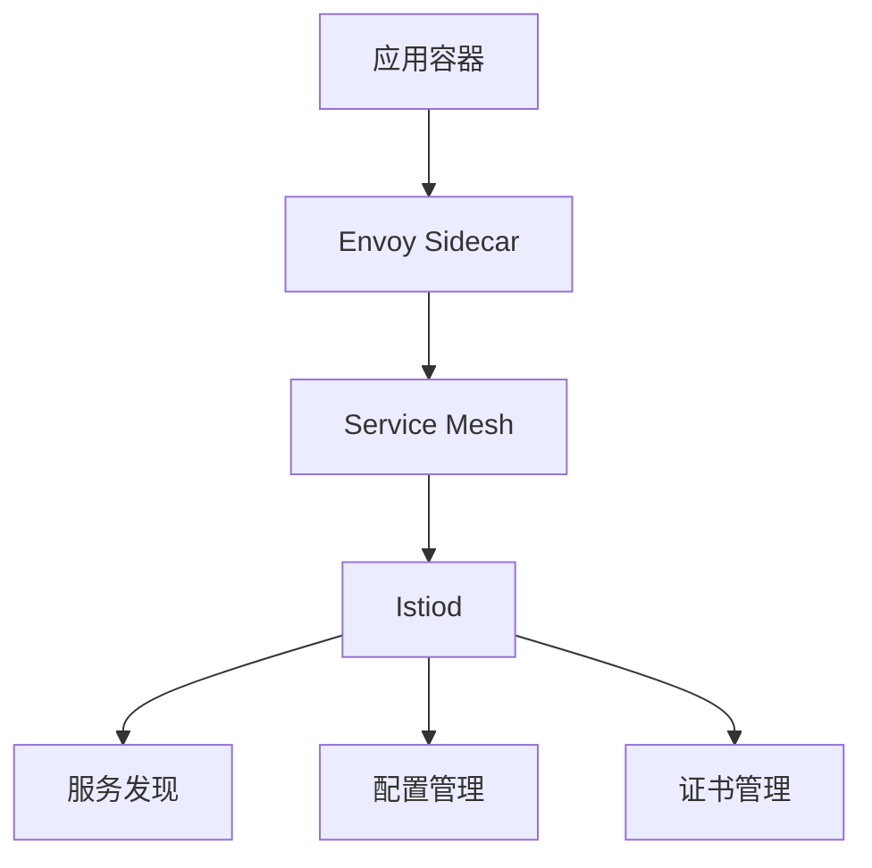

# Istio基础概念指南

## 版本信息
- 版本号: v1.0.0
- 更新日期: 2024-03-21
- 状态: [✅已完成]

## 1. 服务网格概述
服务网格是一个基础设施层，用于处理服务间通信，提供负载均衡、服务发现、流量管理、安全性和可观察性等功能。

## 2. Istio架构
### 2.1 核心组件
1. Istiod（控制平面）
   - Pilot：服务发现和配置
   - Citadel：证书管理和密钥分发
   - Galley：配置验证和分发

2. Envoy（数据平面）
   - 服务代理
   - 流量拦截
   - 策略执行

### 2.2 工作原理


## 3. 流量管理
### 3.1 虚拟服务
```yaml
apiVersion: networking.istio.io/v1alpha3
kind: VirtualService
metadata:
  name: reviews
spec:
  hosts:
  - reviews
  http:
  - route:
    - destination:
        host: reviews
        subset: v1
      weight: 75
    - destination:
        host: reviews
        subset: v2
      weight: 25
```

### 3.2 目标规则
```yaml
apiVersion: networking.istio.io/v1alpha3
kind: DestinationRule
metadata:
  name: reviews
spec:
  host: reviews
  trafficPolicy:
    loadBalancer:
      simple: RANDOM
  subsets:
  - name: v1
    labels:
      version: v1
  - name: v2
    labels:
      version: v2
```

## 4. 安全机制
### 4.1 身份认证
```yaml
apiVersion: security.istio.io/v1beta1
kind: PeerAuthentication
metadata:
  name: default
  namespace: istio-system
spec:
  mtls:
    mode: STRICT
```

### 4.2 授权策略
```yaml
apiVersion: security.istio.io/v1beta1
kind: AuthorizationPolicy
metadata:
  name: httpbin-policy
  namespace: default
spec:
  selector:
    matchLabels:
      app: httpbin
  rules:
  - from:
    - source:
        principals: ["cluster.local/ns/default/sa/sleep"]
    to:
    - operation:
        methods: ["GET"]
```

## 5. 可观察性
### 5.1 指标收集
```yaml
apiVersion: telemetry.istio.io/v1alpha1
kind: Telemetry
metadata:
  name: mesh-default
  namespace: istio-system
spec:
  metrics:
  - providers:
    - name: prometheus
    overrides:
    - match:
        metric: REQUEST_COUNT
        mode: CLIENT_AND_SERVER
      enabled: true
```

### 5.2 分布式追踪
```yaml
apiVersion: telemetry.istio.io/v1alpha1
kind: Telemetry
metadata:
  name: tracing-default
spec:
  tracing:
  - randomSamplingPercentage: 100.0
    providers:
    - name: zipkin
    customTags:
      my_tag_header:
        header:
          name: my-tag-header
```

## 6. 网关
### 6.1 入口网关
```yaml
apiVersion: networking.istio.io/v1alpha3
kind: Gateway
metadata:
  name: bookinfo-gateway
spec:
  selector:
    istio: ingressgateway
  servers:
  - port:
      number: 80
      name: http
      protocol: HTTP
    hosts:
    - "bookinfo.example.com"
```

### 6.2 出口网关
```yaml
apiVersion: networking.istio.io/v1alpha3
kind: ServiceEntry
metadata:
  name: external-svc-https
spec:
  hosts:
  - api.external-service.com
  location: MESH_EXTERNAL
  ports:
  - number: 443
    name: https
    protocol: HTTPS
  resolution: DNS
```

## 7. 故障注入
### 7.1 延迟注入
```yaml
apiVersion: networking.istio.io/v1alpha3
kind: VirtualService
metadata:
  name: ratings
spec:
  hosts:
  - ratings
  http:
  - fault:
      delay:
        percentage:
          value: 10
        fixedDelay: 5s
    route:
    - destination:
        host: ratings
        subset: v1
```

### 7.2 错误注入
```yaml
apiVersion: networking.istio.io/v1alpha3
kind: VirtualService
metadata:
  name: ratings
spec:
  hosts:
  - ratings
  http:
  - fault:
      abort:
        percentage:
          value: 10
        httpStatus: 500
    route:
    - destination:
        host: ratings
        subset: v1
```

## 8. 流量控制
### 8.1 超时控制
```yaml
apiVersion: networking.istio.io/v1alpha3
kind: VirtualService
metadata:
  name: reviews
spec:
  hosts:
  - reviews
  http:
  - timeout: 0.5s
    route:
    - destination:
        host: reviews
        subset: v2
```

### 8.2 重试策略
```yaml
apiVersion: networking.istio.io/v1alpha3
kind: VirtualService
metadata:
  name: reviews
spec:
  hosts:
  - reviews
  http:
  - retries:
      attempts: 3
      perTryTimeout: 2s
    route:
    - destination:
        host: reviews
        subset: v2
```

## 9. 服务弹性
### 9.1 熔断器
```yaml
apiVersion: networking.istio.io/v1alpha3
kind: DestinationRule
metadata:
  name: reviews
spec:
  host: reviews
  trafficPolicy:
    outlierDetection:
      consecutive5xxErrors: 1
      interval: 1s
      baseEjectionTime: 3m
      maxEjectionPercent: 100
```

### 9.2 负载均衡
```yaml
apiVersion: networking.istio.io/v1alpha3
kind: DestinationRule
metadata:
  name: reviews
spec:
  host: reviews
  trafficPolicy:
    loadBalancer:
      simple: LEAST_CONN
```

## 10. 最佳实践
1. 合理规划命名空间
2. 实施渐进式网格迁移
3. 配置适当的资源限制
4. 实施监控和告警
5. 定期更新版本
6. 做好备份和恢复
7. 实施变更管理
8. 保持文档更新

## 参考资料
1. Istio官方文档
2. 服务网格实践指南
3. Envoy代理文档 