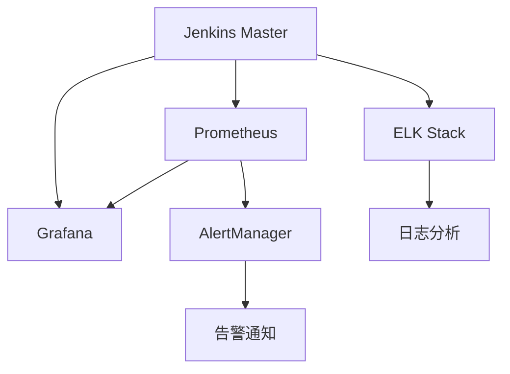

# Jenkins监控告警指南

## 版本信息
- 版本号: v1.0.0
- 更新日期: 2024-03-21
- 状态: [✅已完成]

## 1. 监控架构
### 1.1 整体架构


### 1.2 监控指标
1. 系统指标
   - CPU使用率
   - 内存使用率
   - 磁盘使用率
   - 网络IO

2. JVM指标
   - 堆内存使用
   - 非堆内存
   - GC情况
   - 线程状态

3. Jenkins指标
   - 构建队列
   - 执行器状态
   - 在线节点数
   - 任务状态

### 1.3 告警级别
1. 严重告警
   - 服务不可用
   - 数据丢失风险
   - 安全漏洞

2. 警告告警
   - 性能下降
   - 资源紧张
   - 构建失败

3. 提示告警
   - 配置变更
   - 版本更新
   - 任务完成

## 2. 监控配置
### 2.1 Prometheus配置
1. Jenkins Prometheus插件配置
```xml
<jenkins.prometheus.config.PrometheusConfiguration>
  <path>/prometheus</path>
  <defaultNamespace>jenkins</defaultNamespace>
  <useAuthenticatedEndpoint>true</useAuthenticatedEndpoint>
</jenkins.prometheus.config.PrometheusConfiguration>
```

2. Prometheus配置文件
```yaml
global:
  scrape_interval: 15s
  evaluation_interval: 15s

scrape_configs:
  - job_name: 'jenkins'
    metrics_path: '/prometheus'
    static_configs:
      - targets: ['jenkins:8080']
    basic_auth:
      username: 'prometheus'
      password: 'secret'
```

3. 告警规则配置
```yaml
groups:
- name: jenkins_alerts
  rules:
  - alert: JenkinsDown
    expr: up{job="jenkins"} == 0
    for: 5m
    labels:
      severity: critical
    annotations:
      summary: "Jenkins实例宕机"
      description: "Jenkins实例{{ $labels.instance }}已经宕机超过5分钟"

  - alert: HighCPUUsage
    expr: rate(process_cpu_seconds_total{job="jenkins"}[5m]) * 100 > 80
    for: 10m
    labels:
      severity: warning
    annotations:
      summary: "Jenkins CPU使用率过高"
      description: "Jenkins实例{{ $labels.instance }} CPU使用率超过80%持续10分钟"

  - alert: HighMemoryUsage
    expr: process_resident_memory_bytes{job="jenkins"} / node_memory_MemTotal_bytes * 100 > 90
    for: 10m
    labels:
      severity: warning
    annotations:
      summary: "Jenkins内存使用率过高"
      description: "Jenkins实例{{ $labels.instance }}内存使用率超过90%持续10分钟"
```

### 2.2 Grafana配置
1. 数据源配置
```json
{
  "name": "Prometheus",
  "type": "prometheus",
  "url": "http://prometheus:9090",
  "access": "proxy",
  "basicAuth": true,
  "basicAuthUser": "admin",
  "secureJsonData": {
    "basicAuthPassword": "secret"
  }
}
```

2. 仪表板配置
```json
{
  "dashboard": {
    "id": null,
    "title": "Jenkins Overview",
    "tags": ["jenkins"],
    "timezone": "browser",
    "panels": [
      {
        "title": "CPU Usage",
        "type": "graph",
        "datasource": "Prometheus",
        "targets": [
          {
            "expr": "rate(process_cpu_seconds_total{job=\"jenkins\"}[5m]) * 100"
          }
        ]
      },
      {
        "title": "Memory Usage",
        "type": "graph",
        "datasource": "Prometheus",
        "targets": [
          {
            "expr": "process_resident_memory_bytes{job=\"jenkins\"}"
          }
        ]
      }
    ]
  }
}
```

### 2.3 ELK配置
1. Filebeat配置
```yaml
filebeat.inputs:
- type: log
  enabled: true
  paths:
    - /var/log/jenkins/*.log
  fields:
    type: jenkins
    
output.elasticsearch:
  hosts: ["elasticsearch:9200"]
  index: "jenkins-%{+yyyy.MM.dd}"
```

2. Logstash配置
```conf
input {
  beats {
    port => 5044
  }
}

filter {
  if [fields][type] == "jenkins" {
    grok {
      match => { "message" => "%{TIMESTAMP_ISO8601:timestamp} %{LOGLEVEL:level} %{GREEDYDATA:msg}" }
    }
  }
}

output {
  elasticsearch {
    hosts => ["elasticsearch:9200"]
    index => "jenkins-%{+YYYY.MM.dd}"
  }
}
```

3. Kibana配置
```yaml
server.name: kibana
server.host: "0.0.0.0"
elasticsearch.hosts: ["http://elasticsearch:9200"]
monitoring.ui.container.elasticsearch.enabled: true
```

## 3. 告警配置
### 3.1 邮件告警
1. Jenkins邮件配置
```xml
<hudson.tasks.Mailer_-DescriptorImpl>
  <smtpHost>smtp.example.com</smtpHost>
  <smtpPort>587</smtpPort>
  <useSsl>true</useSsl>
  <charset>UTF-8</charset>
</hudson.tasks.Mailer_-DescriptorImpl>
```

2. 告警模板
```html
<!DOCTYPE html>
<html>
<head>
    <title>${BUILD_STATUS}</title>
</head>
<body>
    <h2>${PROJECT_NAME} - Build #${BUILD_NUMBER}</h2>
    <p>状态: ${BUILD_STATUS}</p>
    <p>详情: <a href="${BUILD_URL}">${BUILD_URL}</a></p>
    <h3>变更记录:</h3>
    <pre>${CHANGES}</pre>
    <h3>构建日志(最后100行):</h3>
    <pre>${BUILD_LOG}</pre>
</body>
</html>
```

### 3.2 Slack告警
1. Slack配置
```groovy
pipeline {
    post {
        failure {
            slackSend (
                channel: '#jenkins-alerts',
                color: 'danger',
                message: """
                    构建失败: Job ${env.JOB_NAME} [${env.BUILD_NUMBER}]
                    详情: ${env.BUILD_URL}
                """
            )
        }
    }
}
```

2. 告警规则
```groovy
def notifySlack(String buildStatus) {
    def color = buildStatus == 'SUCCESS' ? 'good' : 'danger'
    def message = """
        构建状态: ${buildStatus}
        Job: ${env.JOB_NAME} [${env.BUILD_NUMBER}]
        持续时间: ${currentBuild.durationString}
        详情: ${env.BUILD_URL}
    """
    slackSend(color: color, message: message)
}
```

### 3.3 钉钉告警
1. 钉钉机器人配置
```groovy
pipeline {
    post {
        failure {
            dingtalk (
                robot: 'jenkins-alert',
                type: 'MARKDOWN',
                title: '构建失败通知',
                text: [
                    "### 构建失败: ${env.JOB_NAME}",
                    "> 构建号: ${env.BUILD_NUMBER}",
                    "> 触发原因: ${currentBuild.getBuildCauses()[0].shortDescription}",
                    "> 持续时间: ${currentBuild.durationString}",
                    "",
                    "详情点击: [构建详情](${env.BUILD_URL})"
                ].join('\n')
            )
        }
    }
}
```

2. 告警模板
```markdown
### ${ALERT_TITLE}
> 级别: ${ALERT_LEVEL}
> 时间: ${ALERT_TIME}
> 描述: ${ALERT_DESCRIPTION}

#### 详细信息
${ALERT_DETAILS}

#### 处理建议
${ALERT_SUGGESTION}
```

## 4. 监控面板
### 4.1 系统概览
1. 资源使用
```sql
# CPU使用率
rate(process_cpu_seconds_total{job="jenkins"}[5m]) * 100

# 内存使用率
process_resident_memory_bytes{job="jenkins"} / node_memory_MemTotal_bytes * 100

# 磁盘使用率
node_filesystem_free_bytes{mountpoint="/var/lib/jenkins"} / node_filesystem_size_bytes{mountpoint="/var/lib/jenkins"} * 100
```

2. 构建统计
```sql
# 构建成功率
sum(jenkins_builds_success_total) / sum(jenkins_builds_total) * 100

# 构建时长分布
histogram_quantile(0.95, sum(rate(jenkins_builds_duration_seconds_bucket[1h])) by (le))

# 队列长度
jenkins_queue_size_value
```

### 4.2 节点状态
1. 节点监控
```sql
# 在线节点数
jenkins_node_online_value

# 节点负载
jenkins_node_builds_current_value

# 执行器使用率
sum(jenkins_executor_in_use_value) / sum(jenkins_executor_count_value) * 100
```

2. 任务监控
```sql
# 任务状态分布
sum(jenkins_job_status) by (result)

# 任务执行时长
rate(jenkins_job_duration_milliseconds_sum[5m]) / rate(jenkins_job_duration_milliseconds_count[5m])

# 失败任务TOP10
topk(10, sum(jenkins_job_failed_total) by (job_name))
```

### 4.3 性能分析
1. JVM监控
```sql
# GC次数
rate(java_lang_garbage_collector_collection_count_total[5m])

# GC时间
rate(java_lang_garbage_collector_collection_time_seconds_total[5m])

# 线程数
java_lang_threading_threadcount

# 堆内存使用
java_lang_memory_heapmemoryusage_used / java_lang_memory_heapmemoryusage_max * 100
```

2. HTTP监控
```sql
# 请求延迟
histogram_quantile(0.95, sum(rate(jenkins_http_request_duration_seconds_bucket[5m])) by (le))

# 请求错误率
sum(rate(jenkins_http_request_total{code=~"5.."}[5m])) / sum(rate(jenkins_http_request_total[5m])) * 100

# 并发请求数
sum(rate(jenkins_http_request_total[5m]))
```

## 5. 告警处理
### 5.1 告警流程
1. 告警产生
   - 监控指标超阈值
   - 系统异常事件
   - 安全事件

2. 告警分发
   - 按级别分发
   - 按团队分发
   - 告警去重

3. 告警处理
   - 问题确认
   - 处理措施
   - 结果验证

### 5.2 告警升级
1. 升级策略
```yaml
routes:
  - receiver: 'team-jenkins'
    group_by: ['alertname', 'instance']
    group_wait: 30s
    group_interval: 5m
    repeat_interval: 4h
    routes:
    - receiver: 'jenkins-critical'
      match:
        severity: critical
      group_wait: 0s
      repeat_interval: 1h
```

2. 升级流程
   - L1: 运维工程师
   - L2: 运维主管
   - L3: 技术总监

### 5.3 告警记录
1. 记录格式
```json
{
  "alert_id": "uuid",
  "alert_name": "JenkinsDown",
  "severity": "critical",
  "start_time": "2024-03-21T10:00:00Z",
  "end_time": "2024-03-21T10:30:00Z",
  "status": "resolved",
  "description": "Jenkins实例宕机",
  "handler": "admin",
  "resolution": "重启服务恢复",
  "root_cause": "内存溢出导致服务崩溃"
}
```

2. 统计分析
```sql
# 告警频率分析
SELECT alert_name, COUNT(*) as count
FROM alerts
WHERE start_time >= NOW() - INTERVAL 7 DAY
GROUP BY alert_name
ORDER BY count DESC;

# 平均处理时间
SELECT alert_name, 
       AVG(TIMESTAMPDIFF(MINUTE, start_time, end_time)) as avg_duration
FROM alerts
WHERE status = 'resolved'
GROUP BY alert_name;
```

## 6. 最佳实践
### 6.1 监控策略
1. 分级监控
   - 核心指标
   - 业务指标
   - 性能指标

2. 阈值设置
   - 基于历史数据
   - 动态阈值
   - 多级阈值

3. 告警抑制
   - 时间抑制
   - 数量抑制
   - 依赖抑制

### 6.2 告警优化
1. 告警收敛
   - 相似告警合并
   - 告警静默
   - 告警过滤

2. 告警路由
   - 按团队路由
   - 按级别路由
   - 按时间路由

3. 告警通知
   - 多渠道通知
   - 通知模板
   - 通知时间

### 6.3 运维建议
1. 日常维护
   - 定期检查监控
   - 更新告警规则
   - 清理历史数据

2. 应急处理
   - 告警响应机制
   - 问题排查流程
   - 应急预案

3. 持续优化
   - 监控覆盖率
   - 告警准确率
   - 处理效率

## 参考资料
1. Prometheus官方文档
2. Grafana官方文档
3. Jenkins监控插件文档
4. 监控最佳实践指南 